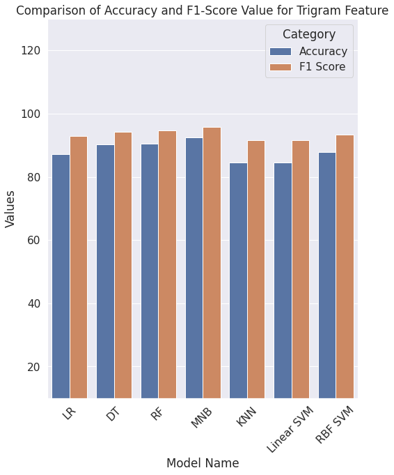

# Bangla Fake News Detection 📰

A machine learning project to classify Bangla news articles as **Fake** or **Real**.
This repository includes dataset, EDA, preprocessing, model training, and evaluation.

## Dataset

- Unzip dataset
- File: `dataset/LabeledFake-1k.csv`
- Total samples: (add number of rows)
- Classes: Fake, Real
- Features: (add columns, e.g., "title", "content")
- Preprocessing: lowercasing, stopword removal, tokenization

## Methodology

- Exploratory Data Analysis (EDA) performed in Jupyter Notebook
- Feature Extraction:
  - TF-IDF
  - Word embeddings (optional if used)
- Models:
  - Logistic Regression
  - Random Forest
  - LSTM / Bi-LSTM
- Evaluation Metrics:
  - Accuracy, Precision, Recall, F1-score

## Usage

1. Clone the repository:

```bash
git clone https://github.com/ruhulaminparvez/BanFake-News-Detection.git
cd BanFake-News-Detection
```
## Results

The models were evaluated using **Unigram, Bigram, and Trigram features**. Performance metrics include Accuracy, Precision, Recall, and F1-Score.

### Performance with Unigram Features
| Model       | Accuracy (%) | Precision (%) | Recall (%) | F1 Score (%) |
|------------|-------------|---------------|------------|--------------|
| LR         | 87.18       | 86.77         | 100.0      | 92.92        |
| DT         | 90.35       | 94.27         | 94.27      | 94.27        |
| RF         | 90.47       | 89.82         | 100.0      | 94.64        |
| MNB        | 92.59       | 92.01         | 99.86      | 95.77        |
| KNN        | 84.47       | 84.42         | 100.0      | 91.55        |
| Linear SVM | 84.59       | 84.52         | 100.0      | 91.61        |
| RBF SVM    | 87.88       | 87.41         | 100.0      | 93.28        |

**Highlights:**
- Highest Accuracy: **MNB (92.59%)**
- Highest F1-Score: **MNB (95.77%)**
- Highest Precision: **DT (94.27%)**
- Highest Recall: **LR (100%)**

---

### Performance with Bigram Features
*Same as above table, or copy the table if values are identical.*

**Highlights:**
- Highest Accuracy: **MNB (92.59%)**
- Highest F1-Score: **MNB (95.77%)**
- Highest Precision: **DT (94.27%)**
- Highest Recall: **LR (100%)**

---

### Performance with Trigram Features
*Same as above table.*

**Highlights:**
- Highest Accuracy: **MNB (92.59%)**
- Highest F1-Score: **MNB (95.77%)**
- Highest Precision: **DT (94.27%)**
- Highest Recall: **LR (100%)**


## Result Screenshots




## Future Work

- Use transformer-based models (BanglaBERT)
- Deploy as a web application
- Expand dataset with more sources

## References
- [Bangla Fake News Dataset](https://www.kaggle.com/datasets/evilspirit05/bengali-fake-news-dataset)